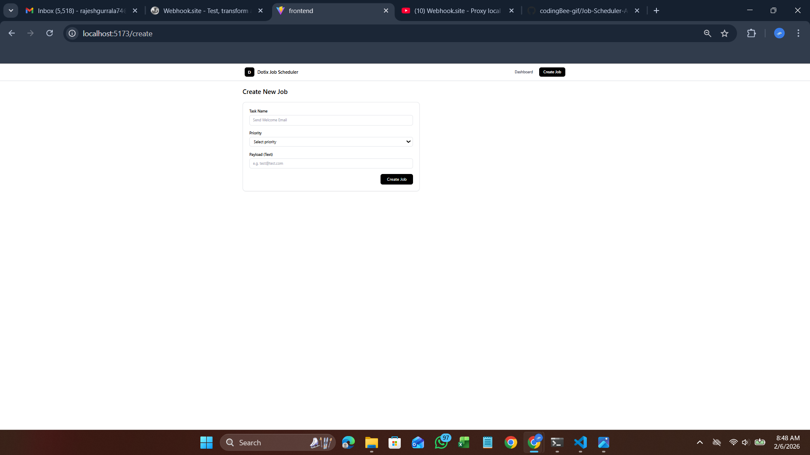
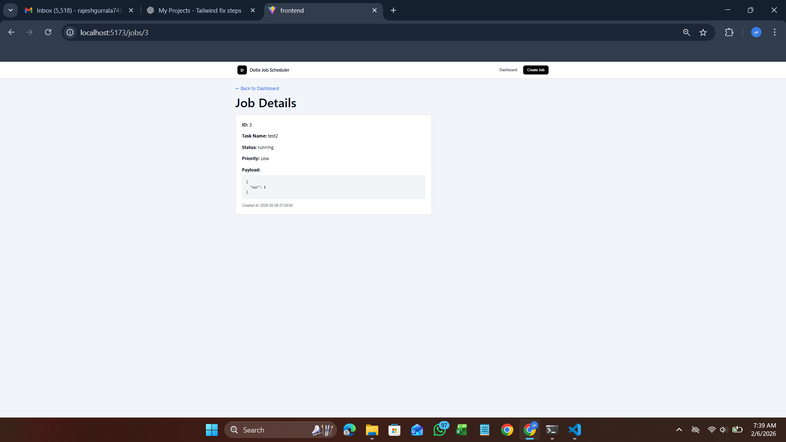
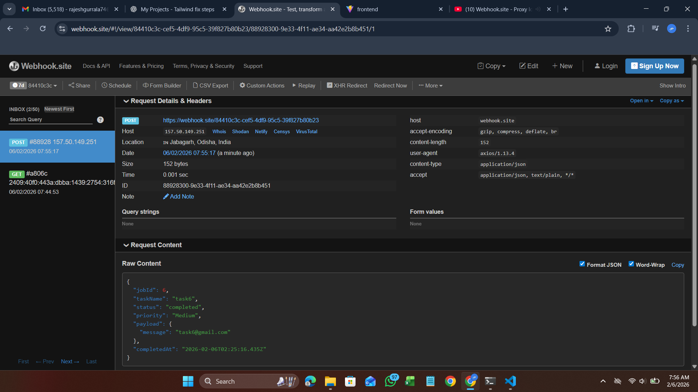

# Dotix – Job Scheduler & Automation System

A mini **Job Scheduling and Automation System** built as part of the Dotix assignment.  
This project demonstrates full-stack understanding: **frontend UI, backend APIs, database design, job execution flow, and webhook integration**.

---

## 🚀 Project Overview

The system allows users to:

- Create background jobs
- View jobs in a dashboard
- Filter jobs by status and priority
- Run jobs manually
- Track job lifecycle (Pending → Running → Completed)
- Automatically trigger a webhook when a job completes

This closely mirrors real-world automation systems used for:
- Background processing
- Email jobs
- Report generation
- System integrations via webhooks

---

## 🧱 Tech Stack

### Frontend
- **React.js**
- **Tailwind CSS** (desktop-first UI)
- React Router
- Axios

### Backend
- **Node.js**
- **Express.js**
- REST API architecture

### Database
- **SQLite**

### Integration
- **Webhook trigger** (tested using webhook.site)

---

## 🧠 Key Concepts Demonstrated

### Backend
- RESTful API design
- Input validation
- SQLite database schema & queries
- Job state management
- Async job simulation
- Webhook integration
- Separation of concerns (routes, controllers, services)

### Frontend
- Functional components
- Routing (`react-router-dom`)
- State management with hooks
- API integration
- Conditional rendering
- Loading states & UI polish
- Desktop-grade admin dashboard design

---

## 🔁 Job Lifecycle

Create Job → Pending → Run Job → Running → Completed → Webhook Triggered

---

## ▶️ How to Run the Project

### backend setup
cd backend
npm install
node server.js
backend runs on: http://localhost:5000

### frontend Setup
cd frontend
npm install
npm run dev
frontend runs on: http://localhost:5173/

## 📸 Screenshots

### Dashboard

### Create Job

### Job Detail

### Webhook Trigger (Job Completion)

